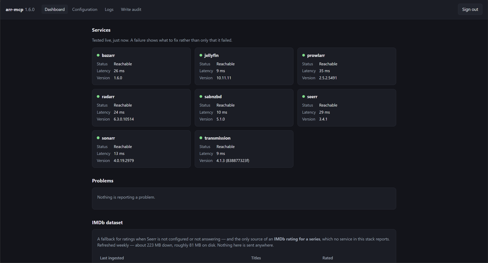

<div align="center">

# arr-mcp

### Talk to your entire media stack. One server, one endpoint, one conversation.

**Radarr · Sonarr · Prowlarr · Bazarr · Jellyfin · Seerr · SABnzbd · Transmission**

[](https://github.com/bardesss/arr-mcp/releases)
[](https://github.com/bardesss/arr-mcp/actions)
[](https://github.com/bardesss/arr-mcp/pkgs/container/arr-mcp)
[](https://github.com/bardesss/arr-mcp/pkgs/container/arr-mcp)
[](LICENSE)



</div>

## Everyone else ships one MCP server per service. This is one for the stack.

That difference is the whole point, because the interesting questions live
*between* services:

> *"Why isn't the film I requested on Tuesday showing up in Jellyfin?"*

No single service can answer that. It spans Seerr, Radarr, Prowlarr, SABnzbd and
Jellyfin — five APIs, five sets of ids, five half-answers. arr-mcp correlates
them and hands back the causal chain:

```
diagnose { query: "Blade" }
```

> No file on disk yet. Trigger a search in Radarr or Sonarr — nothing is
> downloading and no indexer reported a failure.

One call. One answer. It even answers with a service down, and tells you which
part it could not check rather than guessing across the hole.

## Why people run it

|  | |
| --- | --- |
| 🔍 **`diagnose` answers what no single service can** | Walks the whole chain — requested, managed, monitored, downloaded, indexed, imported, scanned — and names the *first* thing that explains the absence. |
| 🛡️ **Indexer text is data, never instruction** | Release names from public indexers are attacker-controllable and flow straight into model context. arr-mcp fences every one of them. |
| ✋ **Writes are opt-in, previewed, recorded** | Off until you turn them on, per service. Every write shows you exactly what it would do and waits for confirmation — and lands in an audit trail either way. |
| 🖥️ **A config page that diagnoses** | Add services from a browser, see what is broken *and what to do about it*, read the logs and the write audit. No YAML required. |
| 📚 **Twenty-two tools, one vocabulary** | Every list pages the same way, every error names the config key that would fix it, every write takes ids rather than titles. |

Nothing else in this space does the last four at all.

## Quick start — about two minutes

Also in the repo as [`docker-compose.example.yml`](docker-compose.example.yml).

```yaml
services:
  arr-mcp:
    image: ghcr.io/bardesss/arr-mcp:latest
    container_name: arr-mcp
    ports:
      - 6060:6060
    volumes:
      - ./config:/config
    environment:
      - PUID=1000
      - PGID=1000
      - TZ=Europe/Amsterdam
    restart: unless-stopped
```

**1. Open `http://<host>:6060`** — the bare host, no path. Nothing to read out
of the container log.

**2. Claim it.** The first page is a setup form rather than a sign-in: choose a
username and a password of at least 12 characters.

> [!IMPORTANT]
> Do this **before** exposing the port. Until it is claimed, whoever loads that
> page first owns the instance — and it holds every service's API key.

**3. Add your services** — **Add a service**, paste its URL and API key, save.
It applies immediately; there is no restart. Configure only what you run.

Your MCP client goes to `http://<host>:6060/mcp` with the bearer token shown on
the dashboard. Everything the UI does is still just `config.yaml`, and editing
that by hand remains supported. Clients that read the
[MCP Registry](https://registry.modelcontextprotocol.io) find it there as
`io.github.bardesss/arr-mcp`.

**Works with whatever you point at it.** A client asking for
`Accept: application/json` — or sending no `Accept` at all — gets one JSON object
back with a `Content-Length`, rather than a refusal for not also naming
`text/event-stream`. A client that does accept a stream still gets one. Even a
refusal is JSON. So a plain `curl` works as-is, and so does a full MCP client.

Image tags are `X.Y.Z`, `X.Y`, `X` and `latest`, plus `main` for bleeding edge.
Pin a minor — `:1.6` — if you would rather approve each new tool surface
yourself. Images are published for **amd64 and arm64**, so a Raspberry Pi or an
ARM NAS runs the same build as everything else.

## What you can ask it

Twenty-two tools, but you never name them — you ask, and the model picks:

> *"What's downloading right now, and is anything stuck?"*
> *"What aired this week that I haven't watched?"*
> *"Which of my indexers are failing, and what did they say?"*
> *"Find me something highly rated from 1994 I don't already have."*
> *"Unmonitor season 5 and delete its files."* — previewed first, always.

## Documentation

| | |
| --- | --- |
| **[Tools](docs/tools.md)** | All twenty-two, what each answers, and the fields whose meaning is not obvious |
| **[Writes](docs/writes.md)** | Turning them on, the two tiers, and the preview-and-confirm handshake |
| **[Configuration](docs/configuration.md)** | `config.yaml`, several Radarrs, Jellyfin's `default_user` |
| **[Config UI](docs/config-ui.md)** | The four pages, and what each does that is not obvious |
| **[IMDb ratings](docs/imdb.md)** | The only way to get an IMDb score for a series, and what it costs |
| **[Contributing](CONTRIBUTING.md)** | Adding a service adapter, and the rules an AI agent tends to break |

## Requirements

- At least one supported service, LAN-reachable: Radarr 4.0+, Sonarr 4.0+,
  Prowlarr 1.0+, Bazarr 1.4+, Jellyfin 10.8+, Seerr 1.0+, SABnzbd 3.0+,
  Transmission 3.0+
- Docker, or Node 24+ to run from source
- An MCP client speaking protocol revision `2026-07-28`

Since 1.0 the tool surface is the public API: renaming or removing a tool, a
parameter or a response field is a **major**, because that break is silent — a
model stops finding a renamed tool rather than raising an error.

## Contributing

**Contributions are welcome, and new service adapters most of all** — Lidarr,
Readarr, qBittorrent, Tautulli. An adapter is deliberately the most
self-contained thing in the codebase. One thing to know first: **I cannot test a
service I do not run**, so the bar is that you tested it against your own live
instance and the PR says what you tested and against which version.

**AI-assisted contributions are welcome**, held to the same bar and no other;
arr-mcp is itself built with a coding agent. Point yours at
[CONTRIBUTING.md](CONTRIBUTING.md#if-you-are-working-with-a-coding-agent).

**Missing a tool?** [Open an issue](../../issues/new/choose) describing the
question you could not get answered rather than the tool you think should
exist — at twenty-two tools the answer is usually a new parameter on one that
already exists.

## Security

arr-mcp is **not designed to be exposed to the internet.** The `/mcp` endpoint
requires a bearer token because "LAN-only" is a network assumption rather than a
security control — it fronts up to eight API keys and, once enabled, file
deletion, and a home network contains guest phones and IoT devices. Put it
behind a reverse proxy with TLS if it needs to leave the LAN, and pin
`allowed_hosts` if you do.

## Thanks

arr-mcp is glue; the hard parts belong to other people. Every service it speaks
to is free software maintained largely by volunteers — [Radarr](https://radarr.video),
[Sonarr](https://sonarr.tv), [Prowlarr](https://prowlarr.com),
[Bazarr](https://www.bazarr.media), [Jellyfin](https://jellyfin.org),
[Seerr](https://github.com/seerr-team/seerr), [SABnzbd](https://sabnzbd.org),
[Transmission](https://transmissionbt.com) — as are the libraries it is built
on: [MCP TypeScript SDK](https://github.com/modelcontextprotocol/typescript-sdk),
[Hono](https://hono.dev), [Zod](https://zod.dev), [Pino](https://getpino.io),
[Vitest](https://vitest.dev), [yaml](https://eemeli.org/yaml/) and
[TypeScript](https://www.typescriptlang.org). If you find arr-mcp useful,
consider supporting them first.

When you enable the [IMDb dataset](docs/imdb.md): information courtesy of
[IMDb](https://www.imdb.com), used with permission, for personal and
non-commercial use.

## Licence

[MIT](LICENSE)
