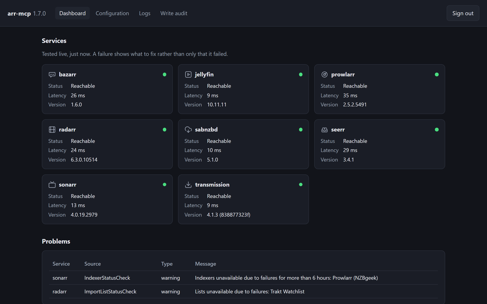
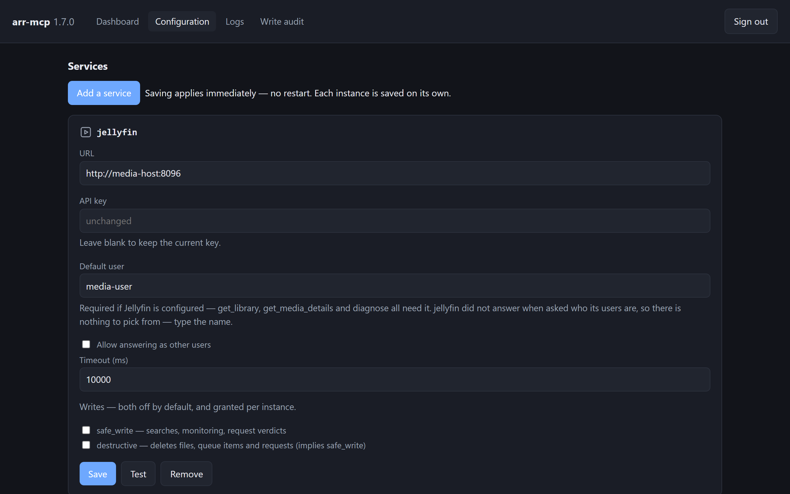
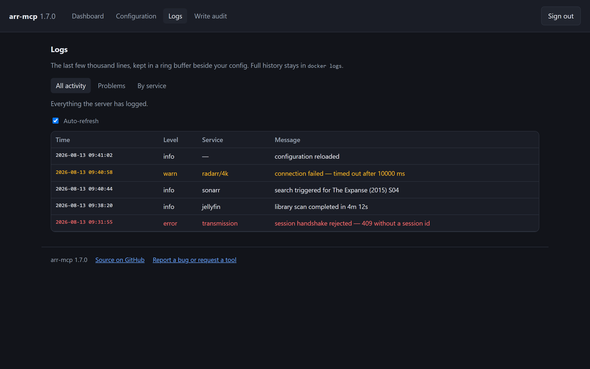
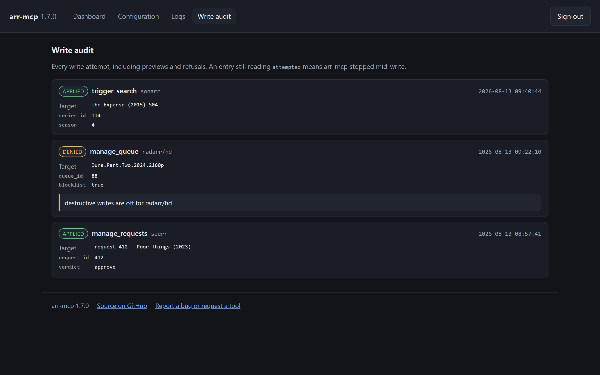

# The config UI

`http://<host>:6060`. Four pages, no restart, no hand-edited YAML.

| Page | What it is for |
| --- | --- |
| Dashboard | Every service tested live, plus disk space, failed health checks, library scan staleness, and the bearer token for your MCP client |
| Configuration | Add, edit, test and remove service instances one at a time; change credentials |
| Logs | Three streams — all activity, problems only, or one service |
| Write audit | Every write attempt — applied, previewed, refused or failed |

The rest of this page is what each one does that is not obvious from looking
at it.

## The dashboard

**Connection tests diagnose rather than pass or fail.** A service that is down
says what is wrong and what to do about it — the same `kind`, `detail` and
`remedy` the MCP tools return — instead of showing a red cross you then have to
investigate.

The dashboard answers the same four questions `stack_health` does, from the same
code: is it reachable, is anything reporting a problem, is a disk filling up,
and when did each library last finish a scan. A stale scan is the usual reason
something downloaded is still not playable.

**Disk space is listed per filesystem, not per mount.** Services in one stack
are containers over the same host disks, so each of them reports the array, its
own root and its config volume separately — ten rows to tell you about two
disks. The dashboard groups them back together and names the instances that can
see each one, emptiest first.

**It gives you the whole MCP connection.** The endpoint is shown as an absolute
URL, built from the address you reached the page on — so it is already correct
behind a reverse proxy, and there is nothing to assemble by hand. **Copy client
config** puts a ready-to-paste JSON block on your clipboard with the endpoint
and token filled in. That block is assembled in your browser at the moment you
click, never rendered into the page, so the screenshot property below still
holds.

## Secrets

**They never come back out.** API keys, the Transmission password and the UI
password all render as empty fields meaning *unchanged*, so a saved page or a
screenshot cannot carry them. That is also why an empty field can never mean
"clear this" — clearing is expressed by removing the instance.

The bearer token is the deliberate exception — handing it to your MCP client is
the point — and it is masked until you ask.

**Your password manager leaves the Configuration page alone.** None of its
fields is a `password` input, because that is the one thing that makes a browser
read a card as a login form and refill the URL and API key on every load. They
are masked in CSS instead, and carry each manager's own opt-out attribute. The
sign-in page is untouched — that one *should* be filled.

## Configuration

**The page starts empty.** It shows a card per instance you have actually
configured, in alphabetical order, and an **Add a service** button — not eight
blank fieldsets for services you do not run. Each card saves on its own, so
editing your 4K Radarr cannot disturb the HD one.

**Add a service** opens a dialog that only asks what the service needs: pick
Transmission and it wants a username and password, pick anything else and it
wants an API key. Services that can only have one instance drop out of the list
once you have that one, so the picker never offers a choice that ends in
"already configured". With scripting off the dialog is the plain form it used to
be, every field showing, and the server still refuses what does not make sense.

**Test** tries the URL and key *as they are on screen*, saved or not, and tells
you what came back — reachable and how fast, or what is wrong and what to do
about it. Nothing is written to disk, so it is safe to try a URL you are unsure
of. It sits in the **Add a service** dialog, where you can check a new service
before it is added at all, and on every card, where a blank key still means
unchanged — so testing a card you have not touched tests what is already
configured.

**Jellyfin and Seerr suggest their own users.** The default-user field is backed
by the real list, fetched from the service when the page loads, so the name you
save is one the service actually knows rather than one you typed from memory. If
the service does not answer, the field stays a plain text box and says so — you
can always configure a service that is currently down.

Adding a second Radarr, Sonarr or Bazarr asks you to name the one you already
have, and says why: the name becomes part of the id, and that id is the
permission key, the audit column, and what your agent passes. Removing an
instance asks once before it goes, because its API key is not recovered by
re-adding it.

## Logs and the write audit

**Logs are a ring buffer**, kept beside your config and capped, so a chatty
service cannot fill the disk. Full history stays in `docker logs`.

**The write audit reads as entries, not as a spreadsheet.** Each attempt gives
its outcome, tool, service and time on one line, and its target and recorded
arguments underneath, each argument as its own field. The arguments are stored
as a single JSON blob, and a column holding that blob beside six others was
unreadable on a desktop long before it was unreadable on a phone.

Nothing is summarised away: an argument that does not parse is printed exactly
as it was recorded, because a log's whole value is that nothing goes missing
from it. An entry still reading `attempted` means arr-mcp stopped mid-write.

## On a phone

The navigation becomes a full-width row of its own under the title rather than
wrapping into it, form fields are large enough that iOS does not zoom the page
in when you tap one, and no table pushes the page sideways.

## Signing in

A username and password you choose the first time you open the UI. Only a scrypt
hash is stored, so the password cannot be recovered — but it can be replaced:
delete the `password_hash` line from `config.yaml` and restart, and the setup
page comes back exactly as it does on a fresh install.

An instance with no `password_hash` is *unclaimed*, and every page redirects to
setup until someone claims it.

## Applying changes

Changes saved from the config UI take effect immediately — every field,
including `allowed_hosts`. A change you make by hand-editing the file still
needs a restart, because nothing is watching the file; the UI reloads because it
knows it just wrote.

One thing to be careful with: pinning `allowed_hosts` applies at once, so a
wrong hostname locks you out of the page you would fix it from. Recover by
editing `config.yaml` by hand and restarting.

The UI is served over plain http on your LAN, like the services it manages. Put
it behind a reverse proxy with TLS if it needs to leave the LAN, and pin
`allowed_hosts` if you do.
